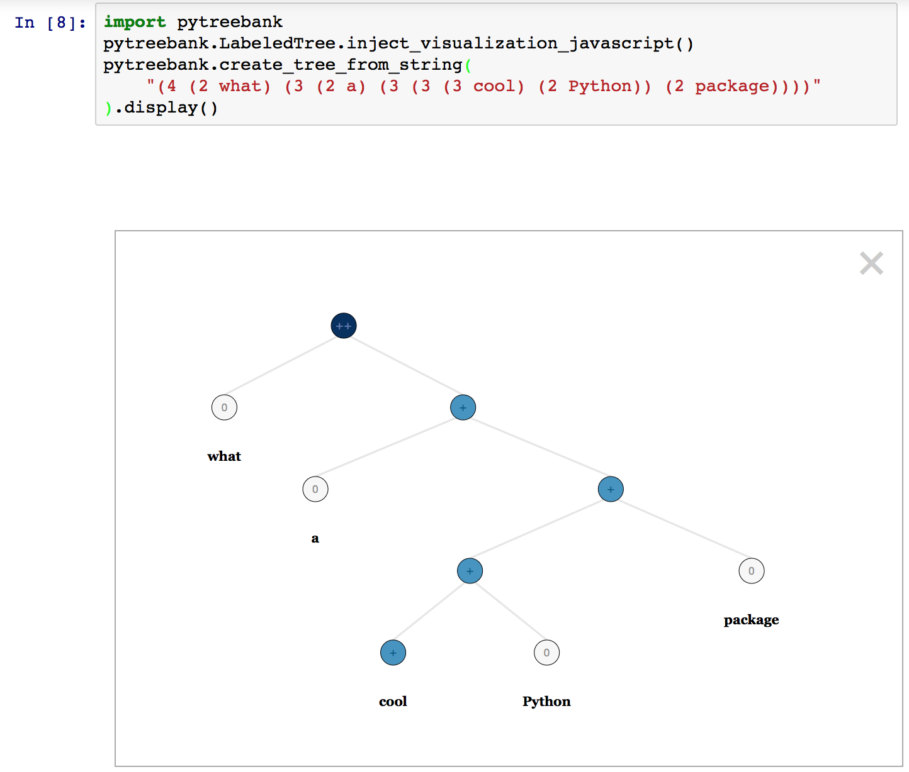

SST Utils
---------

Utilities for downloading, importing, and visualizing the [Stanford Sentiment Treebank](http://nlp.stanford.edu/sentiment/treebank.html), a dataset capturing fine-grained sentiment over movie reviews.
See examples below for usage. Tested in Python `3.4.3` and `2.7.12`.


Javascript code by Jason Chuang and Stanford NLP modified and taken from [Stanford NLP Sentiment Analysis demo](http://nlp.stanford.edu:8080/sentiment/rntnDemo.html).

[](https://badge.fury.io/py/pytreebank)
[](LICENSE.md)

### Visualization

Allows for visualization using Jason Chuang's Javascript and CSS within an IPython notebook:

```python
import pytreebank
# load the sentiment treebank corpus in the parenthesis format,
# e.g. "(4 (2 very ) (3 good))"
dataset = pytreebank.load_sst()
# add Javascript and CSS to the Ipython notebook
pytreebank.LabeledTree.inject_visualization_javascript()
# select and example to visualize
example = dataset["train"][0]
# display it in the page
example.display()
```



### Lines and Labels

To use the corpus to output spans from the different trees you can call the `to_labeled_lines` and `to_lines` method of a `LabeledTree`. The first returned sentence in those lists is always the root sentence:

```python
import pytreebank
dataset = pytreebank.load_sst()
example = dataset["train"][0]

# extract spans from the tree.
for label, sentence in example.to_labeled_lines():
	print("%s has sentiment label %s" % (
		sentence,
		["very negative", "negative", "neutral", "positive", "very positive"][label]
	))
```

### Download/Loading control:

Change the save/load directory by passing a path (this will look for
`train.txt`, `dev.txt` and `test.txt` files under the directory).

```
dataset = pytreebank.load_sst("/path/to/sentiment/")
```

To just load a single dataset file:

```
train_data = pytreebank.import_tree_corpus("/path/to/sentiment/train.txt")
```


